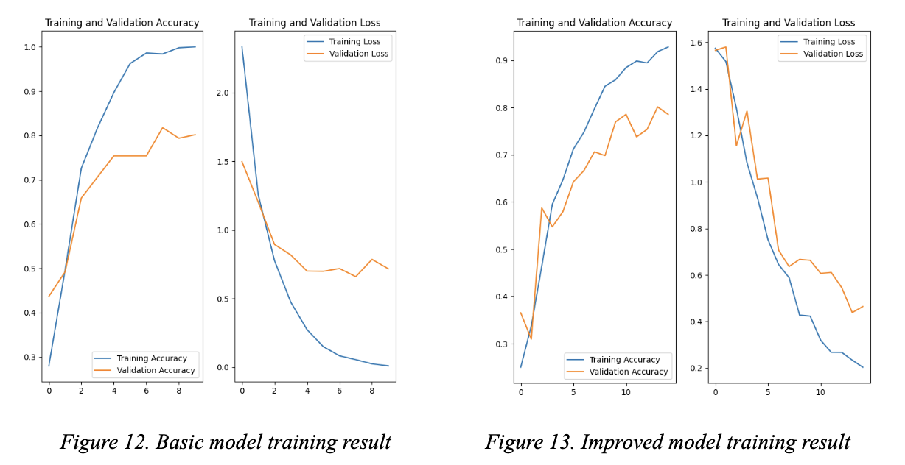

# YogiSnap Models

[View Report](https://docs.google.com/document/d/10gte0gSkbcoHCYk1FDSM9F0Hn2DxJMd7-Y7U7IirwvE/edit?usp=sharing)

This project uses a TensorFlow image classification model to categorise the yoga poses. It classifies images using a
Keras Sequential model.

### Data

There are 5 yoga poses in the dataset, with 630 images in total. Yoga poses including downdog (179 images), goddess (125
images), plank (107 images), tree (58 images), and warrior (166 images). The data was saved in a
tree structure under the project folder. All data is saved in a folder called “data”, underneath which is a "yoga_poses"
folder with five subfolders containing photos of five different yoga poses.


### Models

There are two model created in the project including `basic model` and `improved model`

- **Basic Model**

<table>
<tr>
<td>Basic model</td><td>Model summary</td>
</tr>
<tr>
<td valign="top">

```python
model = Sequential([
    # data normalisation
    layers.Rescaling(1. / 255, input_shape=(img_height, img_width, 3)),
    # 1st convolution block
    layers.Conv2D(16, 3, padding='same', activation='relu'),
    layers.MaxPooling2D(),
    # 2nd convolution block
    layers.Conv2D(32, 3, padding='same', activation='relu'),
    layers.MaxPooling2D(),
    # 3rd convolution block
    layers.Conv2D(64, 3, padding='same', activation='relu'),
    layers.MaxPooling2D(),
    # fully-connected layer
    layers.Flatten(),
    layers.Dense(128, activation='relu'),
    layers.Dense(num_classes)
])
```
</td>
<td>

```text
Model: "sequential"
_________________________________________________________________
 Layer (type)                   Output Shape             Param   
=================================================================
rescaling_1 (Rescaling)        (None, 180, 180, 3)       0         

conv2d (Conv2D)                (None, 180, 180, 16)      448                                                                       
max_pooling2d (MaxPooling2D)   (None, 90, 90, 16)        0

conv2d_1 (Conv2D)              (None, 90, 90, 32)        4640                                                                       
max_pooling2d_1 (MaxPooling2D) (None, 45, 45, 32)        0

conv2d_2 (Conv2D)              (None, 45, 45, 64)        18496    
max_pooling2d_2 (MaxPooling2D) (None, 22, 22, 64)        0

flatten (Flatten)              (None, 30976)             0

dense (Dense)                  (None, 128)               3965056

dense_1 (Dense)                (None, 5)                 645
=================================================================
Total params: 3,989,285
Trainable params: 3,989,285
Non-trainable params: 0
_________________________________________________________________

```
</td>
</tr>
</table>


- **Improved Model**

<table>
<tr>
<td>Improved model</td><td>Model summary</td>
</tr>
<tr>
<td valign="top">

```python
model = Sequential([
    # add augmented data
    data_augmentation,
    # data normalisation
    layers.Rescaling(1. / 255),
    # 1st convolutional block
    layers.Conv2D(16, 3, padding='same', activation='relu'),
    layers.MaxPooling2D(),
    # 2nd convolutional block
    layers.Conv2D(64, 3, padding='same', activation='relu'),
    layers.MaxPooling2D(),
    # 3rd convolutional block
    layers.Conv2D(128, 3, padding='same', activation='relu'),
    layers.MaxPooling2D(),
    # 4th convolutional block
    layers.Conv2D(32, 3, padding='same', activation='relu'),
    layers.MaxPooling2D(),
    # add dropout
    layers.Dropout(0.3),
    # fully-connected layer
    layers.Flatten(),
    layers.Dense(128, activation='relu'),
    layers.Dense(num_classes, name="outputs")
])
```
</td>
<td>

```text

Model: "sequential_1"
_________________________________________________________________
 Layer (type)                Output Shape              Param #   
=================================================================
 sequential (Sequential)        (None, 180, 180, 3)       0         

rescaling_1 (Rescaling)        (None, 180, 180, 3)       0

conv2d (Conv2D)                (None, 180, 180, 16)      448
max_pooling2d (MaxPooling2D)   (None, 90, 90, 16)        0

conv2d_1 (Conv2D)              (None, 90, 90, 64)        9280                                                                      
max_pooling2d_1 (MaxPooling2D) (None, 45, 45, 64)        0

conv2d_2 (Conv2D)              (None, 45, 45, 128)       73856                                                                
max_pooling2d_2 (MaxPooling2D) (None, 22, 22, 128)       0

conv2d_3 (Conv2D)              (None, 22, 22, 32)        36896                                                                     
max_pooling2d_3 (MaxPooling2D) (None, 11, 11, 32)        0

dropout (Dropout)              (None, 11, 11, 32)        0

flatten (Flatten)              (None, 3872)              0

dense (Dense)                  (None, 128)               495744

outputs (Dense)                (None, 5)                 645
                                                                 
=================================================================
Total params: 616,869
Trainable params: 616,869
Non-trainable params: 0
```
</td>
</tr>
</table>

### Training Result

Comparing the training result between basic and improved models


