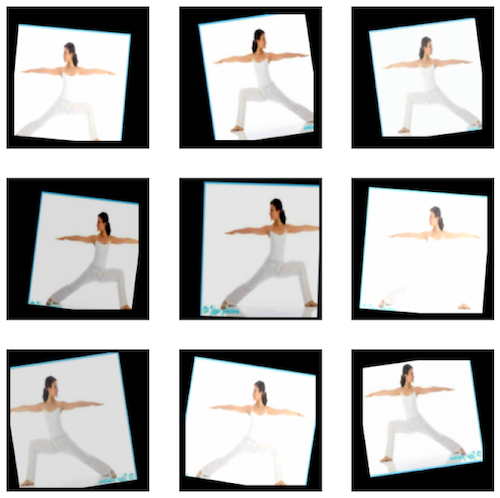

# YogiSnap Models

[View Report](https://docs.google.com/document/d/10gte0gSkbcoHCYk1FDSM9F0Hn2DxJMd7-Y7U7IirwvE/edit?usp=sharing)

This project uses a TensorFlow image classification model to categorise the yoga poses. It classifies images using a
Keras Sequential model.

### Data

In the training dataset, there are 5 yoga poses with 630 images in total. Yoga poses including downdog (179 images),
goddess (125 images), plank (107 images), tree (58 images), and warrior (166 images). The data was saved in a
tree structure under the project folder. All data is saved in a folder called “data”, underneath which is a "yoga_poses"
folder with five subfolders containing photos of five different yoga poses. This dataset is for training and validation
purpose.


*Training dataset. Image source: [Kaggle](https://www.kaggle.com/datasets/ujjwalchowdhury/yoga-pose-classification)*

There is another dataset for testing the model which is under folder "sample", with 40 images in total, including
downdog (11 images), goddess (6 images), plank (8 images), tree (8 images), and warrior (7 images).


*Tasting dataset. Image source: Roehampton University yoga society members*

### Models

There are two model created in the project including `basic model` and `improved model`

- **Basic Model**

<table>
<tr>
<td>Basic model</td><td>Model summary</td>
</tr>
<tr>
<td valign="top">

```python
model = Sequential([
    # data normalisation
    layers.Rescaling(1. / 255, input_shape=(img_height, img_width, 3)),
    # 1st convolution block
    layers.Conv2D(16, 3, padding='same', activation='relu'),
    layers.MaxPooling2D(),
    # 2nd convolution block
    layers.Conv2D(32, 3, padding='same', activation='relu'),
    layers.MaxPooling2D(),
    # 3rd convolution block
    layers.Conv2D(64, 3, padding='same', activation='relu'),
    layers.MaxPooling2D(),
    # fully-connected layer
    layers.Flatten(),
    layers.Dense(128, activation='relu'),
    layers.Dense(num_classes)
])
```

</td>
<td>

```text
Model: "sequential"
_________________________________________________________________
 Layer (type)                   Output Shape             Param   
=================================================================
rescaling_1 (Rescaling)        (None, 180, 180, 3)       0         

conv2d (Conv2D)                (None, 180, 180, 16)      448                                                                       
max_pooling2d (MaxPooling2D)   (None, 90, 90, 16)        0

conv2d_1 (Conv2D)              (None, 90, 90, 32)        4640                                                                       
max_pooling2d_1 (MaxPooling2D) (None, 45, 45, 32)        0

conv2d_2 (Conv2D)              (None, 45, 45, 64)        18496    
max_pooling2d_2 (MaxPooling2D) (None, 22, 22, 64)        0

flatten (Flatten)              (None, 30976)             0

dense (Dense)                  (None, 128)               3965056

dense_1 (Dense)                (None, 5)                 645
=================================================================
Total params: 3,989,285
Trainable params: 3,989,285
Non-trainable params: 0
_________________________________________________________________

```

</td>
</tr>
</table>

- **Improved Model**

The improved model added `data augmentation` to increase the data variety & a dropout layer to address the overfitting.

<table>  
<tr valign="top">
<td>

```python

data_augmentation_layer = keras.Sequential(
    [
        layers.Resizing(img_height, img_width),
        layers.RandomFlip("horizontal"),
        layers.RandomBrightness((-0.25, 0.25)),
        layers.RandomContrast((0.25, 0.25)),
        layers.RandomTranslation((-0.15, 0.15), (-0.15, 0.15), fill_mode='constant'),
        layers.RandomRotation((-0.025, 0.025), fill_mode='constant'),
        # The rotation value is low here, 
        # because too much rotation may make the data dislike the original pose 
        layers.RandomZoom((0, 0.25), fill_mode='constant'),
        # the default fill_mode parameter is 'reflect', 
        # change it to avoid the augmented data look distortion 
    ]
)
augmented_ds = train_ds.map(lambda x, y: (data_augmentation_layer(x), y))
```
[reference-RandomRotation](https://www.tensorflow.org/api_docs/python/tf/keras/layers/RandomRotation)

</td>
<td>



</td>

</tr>
</table> 

<table>
<tr>
<td>Improved model</td><td>Model summary</td>
</tr>
<tr>
<td valign="top">

```python
model = Sequential([
    # Data normalisation
    layers.InputLayer((img_height, img_width, 3)),
    layers.Rescaling(1. / 255),
    # 1st convolutional block
    layers.Conv2D(16, 3, padding='same', activation='relu'),
    layers.MaxPooling2D(),
    # 2nd convolutional block
    layers.Conv2D(32, 3, padding='same', activation='relu'),
    layers.MaxPooling2D(),
    # 3nd convolutional block
    layers.Conv2D(64, 3, padding='same', activation='relu'),
    layers.MaxPooling2D(),
    # 4th convolutional block
    layers.Conv2D(128, 3, padding='same', activation='relu'),
    layers.MaxPooling2D(),
    # 5th convolutional block
    layers.Conv2D(64, 3, padding='same', activation='relu'),
    layers.MaxPooling2D(),
    # 6th convolutional block
    layers.Conv2D(32, 3, padding='same', activation='relu'),
    layers.MaxPooling2D(),
    # Add dropout
    layers.Dropout(0.3),
    # Fully-connected layer
    layers.Flatten(),
    layers.Dense(128, activation='relu'),
    layers.Dense(num_classes, name="outputs")
])
```

</td>
<td>

```text

Model: "sequential_1"
_________________________________________________________________
 Layer (type)                Output Shape              Param #   
=================================================================
 rescaling (Rescaling)           (None, 180, 180, 3)       0         
                                                                 
 conv2d (Conv2D)                 (None, 180, 180, 16)      448                                                                    
 max_pooling2d (MaxPooling2D)    (None, 90, 90, 16)        0         
 
 conv2d_1 (Conv2D)               (None, 90, 90, 32)        4640                                                                      
 max_pooling2d_1 (MaxPooling2D)  (None, 45, 45, 32)        0                                                                  
                                                                 
 conv2d_2 (Conv2D)               (None, 45, 45, 64)        18496                                                                    
 max_pooling2d_2 (MaxPooling2D)  (None, 22, 22, 64)        0                                                                     
                                                                 
 conv2d_3 (Conv2D)               (None, 22, 22, 128)       73856  
 max_pooling2d_3 (MaxPooling2D)  (None, 11, 11, 128)       0         
                                                             
                                                                 
 conv2d_4 (Conv2D)               (None, 11, 11, 64)        73792                                                                    
 max_pooling2d_4 (MaxPooling2D)  (None, 5, 5, 64)          0                                                    
                                                                 
 conv2d_5 (Conv2D)               (None, 5, 5, 32)          18464     
                                                                 
 max_pooling2d_5 (MaxPooling2D)  (None, 2, 2, 32)          0         
 dropout (Dropout)               (None, 2, 2, 32)          0         
                                                                 
 flatten (Flatten)               (None, 128)               0                                                                         
 dense (Dense)                   (None, 128)               16512                                                                    
 outputs (Dense)                 (None, 5)                 645                                                                      
=================================================================
Total params: 206,853
Trainable params: 206,853
Non-trainable params: 0                                                                                                             
_________________________________________________________________
```

</td>
</tr>
</table>

### Training Result

Comparing the training result between basic and improved models

<table>
<tr>
<td>Basic model </td><td>Improved model</td>
</tr>
<tr>
<td>

```python
batch_size = 32

---------------
epochs=10
history = model.fit(
    train_ds,
    validation_data=val_ds,
    epochs=epochs
)
```
</td>
<td>

```python
batch_size = 64

---------------
epochs = 100
history = model.fit(
    augmented_ds,
    validation_data=val_ds,
    epochs=epochs
)
```
</td>


</tr>
<tr>
<td>


</td>
<td valign="top">


</td>
</tr>
</table>

- The improved model  has about `85% accuracy` on testing dataset

### Confusion Matrix

The heatmaps are based on the result of improved model (both training and test dataset), learning what pose get confuse
with other poses.

<table>
<tr>
<td>Training Dataset</td><td>Test Dataset</td>
</tr>
<tr>
<td valign="top" >


</td>
<td valign="top">


</td>
</tr>
</table>
